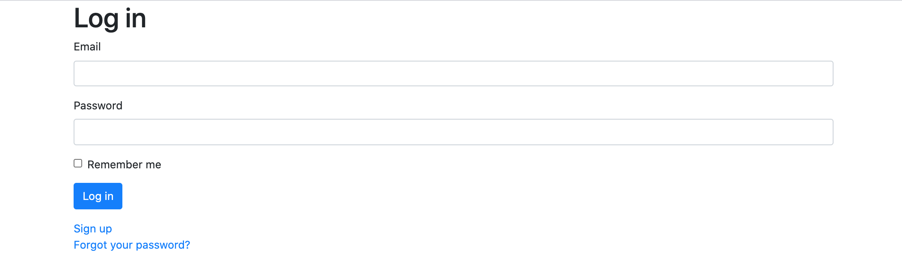
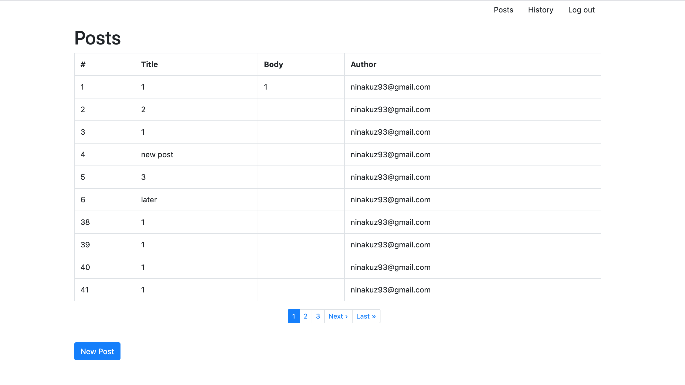
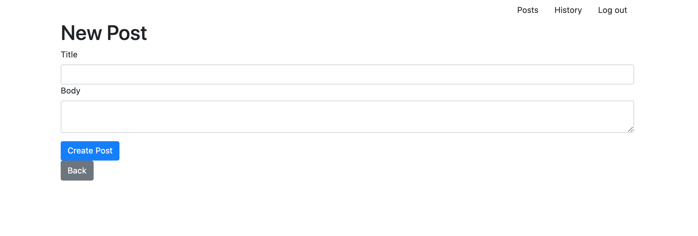
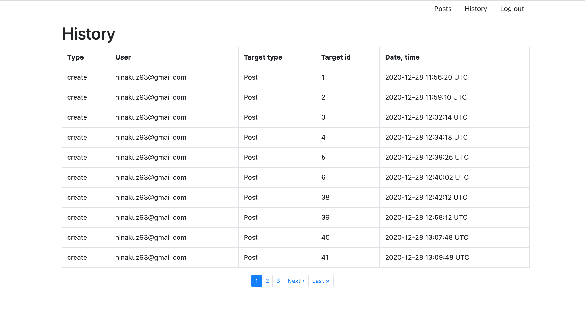

# README

# Docker

Docker container build on top of Evil Martians ideas: https://evilmartians.com/chronicles/ruby-on-whales-docker-for-ruby-rails-development

Suite includes:

* Rails 6.1
* Ruby 3.0.0-rc1
* PostgreSQL
* Sidekiq + Redis
# Setup

```bash
cp .env.example .env
docker-compose build
docker-compose run runner bundle install 
docker-compose run runner yarn install
docker-compose run runner bundle exec rake db:create db:migrate db:seed
docker-compose up -d
```
Then just open in web browser:

```http://localhost:3000```

# Mail settings

File .env contains smtp settings of email for testing. You can fill in the file with your smtp settings

# Testing
To run all rspec test do
```
docker-compose exec runner bundle exec rake db:create db:migrate db:seed RAILS_ENV=test
docker-compose exec runner rspec
```

Open ./coverage/index.html to see coverage results report (100.0% covered at 1.5 hits/line).

# Sidekiq

Mails are sent through Sidekiq, the queue of jobs can be viewed on ```http://localhost:3000/sidekiq```

# RuboСop

Сode analyzer Rubocop was used, you can see it report 

```docker-compose exec runner rubocop --require rubocop-rails```

# Screenshots

Log in page

 

Posts page
 

New post page
 

History page
 
